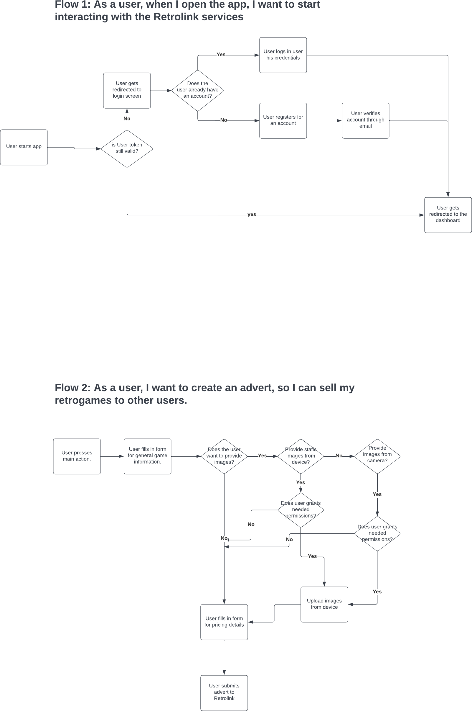
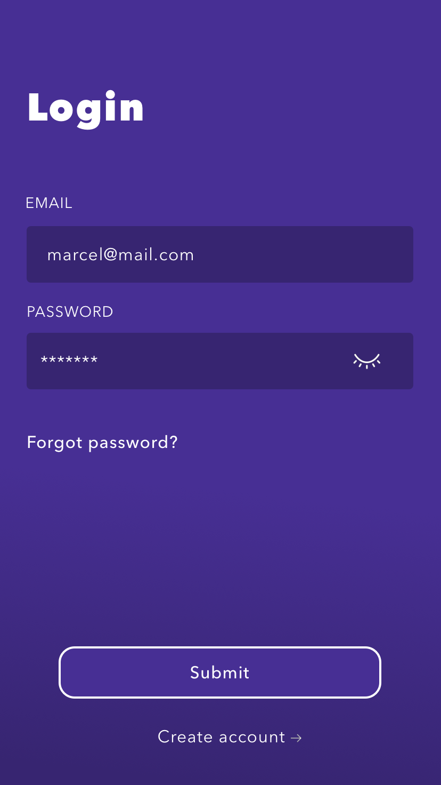

# Retrolink

## Project Description
A React-native marketplace app in which users can buy and or sell used games. With a focus on reselling Retro games. Users can create adverts in which they offer their game. Other users can search in these adverts until they find a game they want to buy. For approaching other users, a messaging system will be in place for searching contact between users.

## Tech Description
The project consists of three parts:
- admin dashboard for managing users and adverts.
- Retrolink the app itself.
- retrolink nodejs backend.

## Purpose
It is a rather big project. But the main purpose is to build something cool, while building a portfolio item. I want to develop myself into a fullstack developer.
With each project that I am building, I will understand fullstack development a bit more.

### Admin dashbaord
A simple react application that will be able to connect with the api, to manage and authorize users. Also it will be possible to manage adverts.
It's important to note that the admin dashboard will be able to make use of endpoints of the api, that are only accessible to users that are created as admin.

- React
- Tailwind css
- Role based JWT authentication

### Retrolink api.
A Express/Nodejs api build to interact with a Postgres database. I've build it with JWT authentication for all of the applications interaction with it.

- Express
- Prisma ORM
- Nodemailer

### Retrolink app
A react native application using Expo.

- JWT authentication
- React Query for data fetching and caching
- Zustand for simple and small state management
- React Context and Hooks for managing user Authentication.
- Styled components.
- Design of the application is built by me.

## Workflow
I try to break up the whole application into user flows which I will create in Lucidshart.
After that I make wireframes, and turn those wireframes into true designs. After the design is done, I will create the feature in code. First backend and then the frontend. It is not an unusual way of working. But the challenge is to really stick and maintain this flow. As a 'programmer-first' it is tempting to code your feature right away, before really thinking of the UX, UI and implementation of flow.

### Flowcharts for the first flows

### First designs
